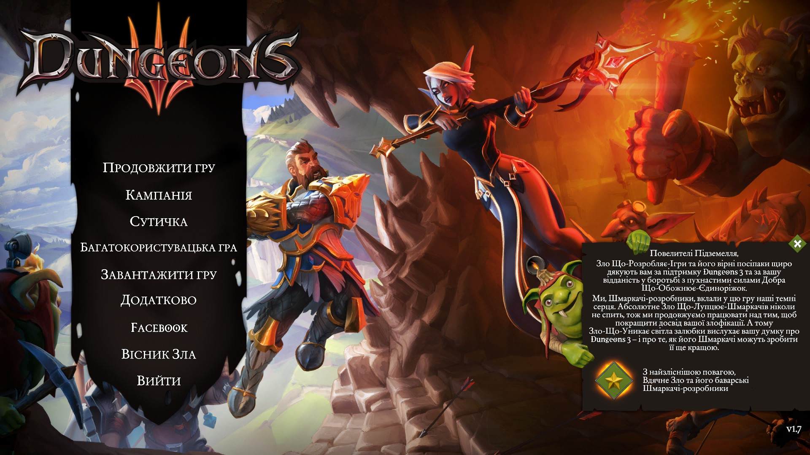
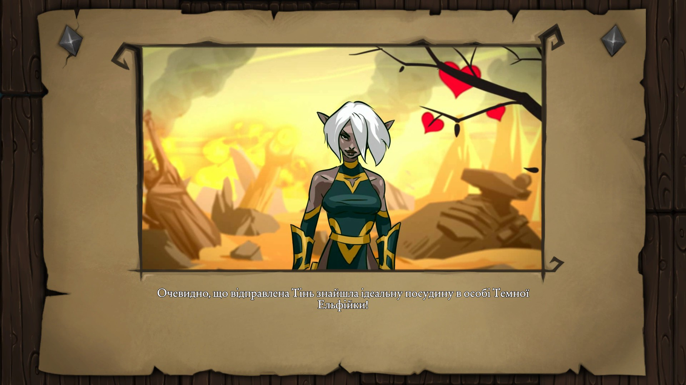
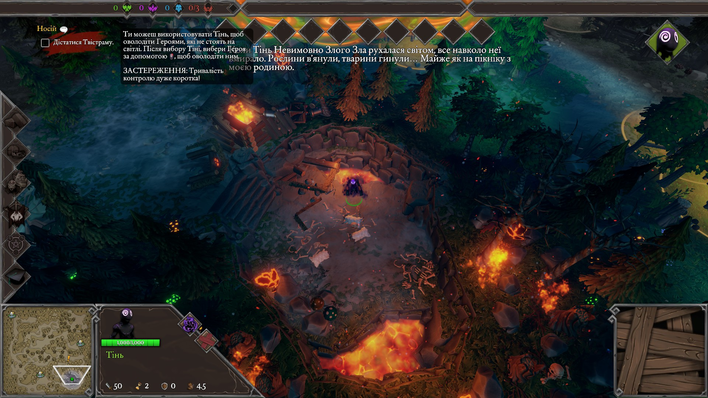
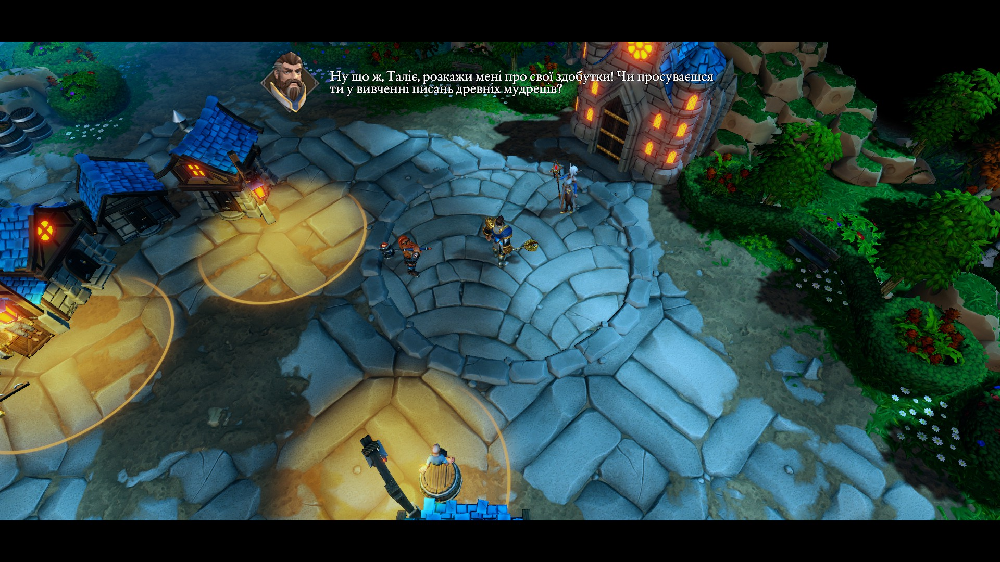
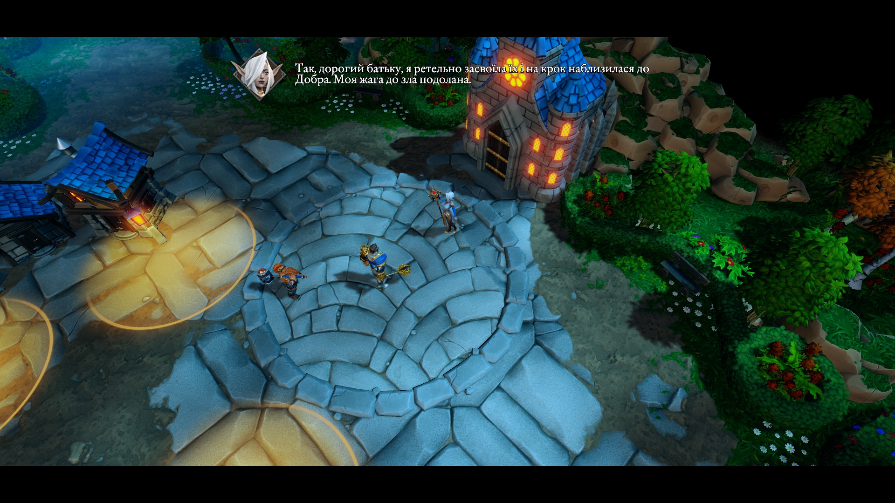
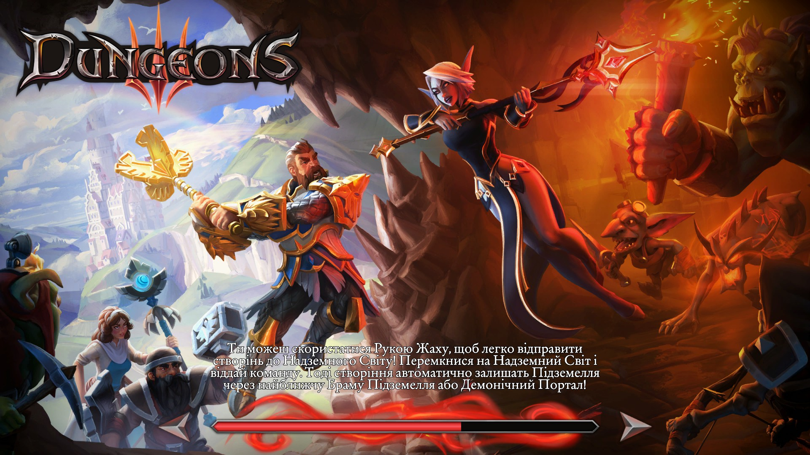
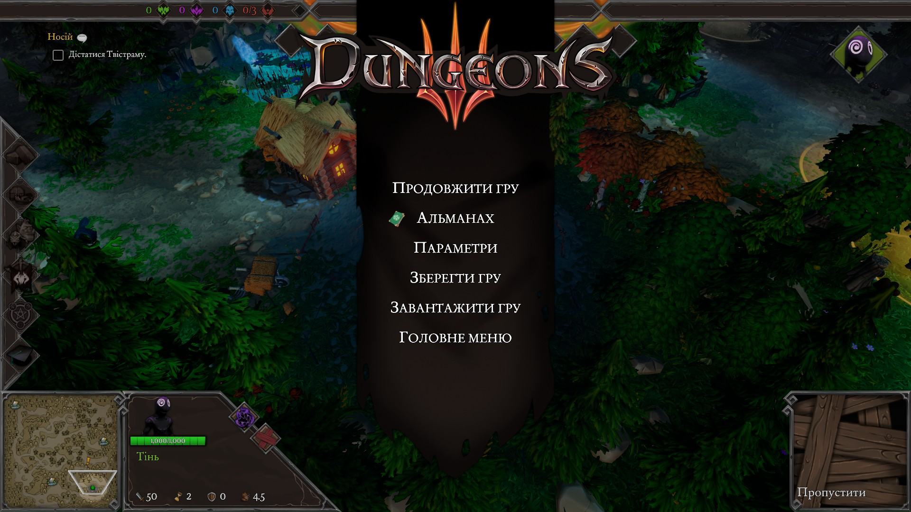
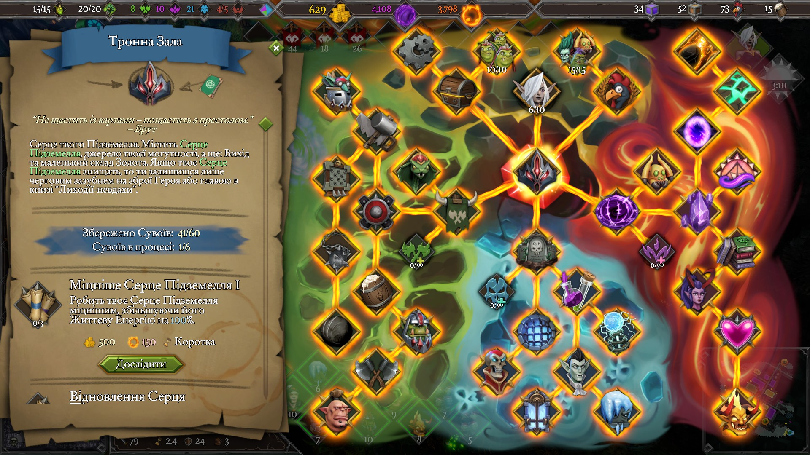

# Українізатор Dungeons 3

## 📑 Зміст

- [🔰 Вступ](#-вступ)
- [📜 Опис](#-опис)
  - [Встановлення локалізації гри](#для-встановлення-локалізації-гри)
  - [Встановлення локалізації досягнень Steam](#для-встановлення-локалізації-досягнень-steam)
- [🔗 Посилання](#-посилання)
  - [📥 Завантажити локалізацію](#-завантажити-локалізацію)
  - [Використані посібники та ресурси](#подяка-авторам-посібників-та-ресурсів-що-були-використані-для-створення-локалізаії)
  - [Щоденники запопадного перекладача](#щоденники-запопадного-перекладача)
- [🐞 Відомі проблеми](#-відомі-проблеми)
- [😈 Автор](#-автор)
- [🗨️ Зворотний зв’язок та подяка](#-зворотний-звязок-та-подяка)

## 🔰 Вступ

**Вітаю, послідовники Абсолютного Зла.**

У темряві своєї глибокої, затишної лабораторії Абсолютне Зло не байдикувало. Ні, воно не займалося знищенням світу (цього разу), а дні й ночі невтомно сиділо над стародавніми сувоями, підручниками, інструкціями зі складання ЗНО, НМТ, чи як воно там зараз називається, намагаючись осягнути всі тонкощі відмінків, наголосів і слів на літеру “ґ”.

Так, Абсолютне Зло вивчило українську! І, звісно ж, не самотужки — воно примусило до цього всіх своїх підлеглих та, навіть, героїв, що були ув’язнені у катакомбах.  
Тепер і ваш улюблений Оповідач, і генералка з розвоєнням особистості — Талія, і Малі Шмаркачі, і вічно п’яна Орда, і пекельні Демони, і, навіть, безмозкі немертві — усі вони заговорили українською. Хтось із гордістю. Хтось із протестом.

Тож радій, Володарю Підземелля, бо відтепер у *Dungeons 3* можна грати *українською мовою*. У цьому посібнику ти дізнаєшся, як саме змусити своїх підлеглих заговорити українською.

---

## 📜 Опис

Ця українська локалізація для *Dungeons 3* забезпечує повний **текстовий** переклад усієї гри: інтерфейсу, діалогів, субтитрів, описів персонажів, приміщень, здібностей, досліджень, всіх доповнень (DLC) та, навіть, досягнень Steam. Переклад створено з урахуванням фірмового гумору гри, адаптованого до українського контексту, із культурними відсиланнями, що будуть зрозумілими українському гравцю.

Оскільки в грі відсутня офіційна підтримка української мови, ця локалізація замінює англійську. Тобто, після встановлення, весь текст, який раніше був англійською, відображатиметься в грі українською мовою. Локалізація працює зі Steam та Epic версіями гри, однак може працювати і з іншими виданнями (потребує тестування).

👉 Локалізація виконана на основі файлів гри версії **1.7**.

Переклад є фанатським і створений неофіційно, з дотриманням духу оригіналу, але без участі розробників гри.

**Приклади перекладу:**

  
  

  
  

  
  

---

## 🛠️ Інструкція зі встановлення

**⚠️ Перед встановленням рекомендується зробити резервну копію оригінальних файлів гри, що замінюються.**

### **Для встановлення локалізації гри:**

1. **Завантажте архів із локалізацією** та **розпакуйте архів у зручне місце**
    [Google Drive](https://drive.google.com/file/d/13Xm8KNgaM8hkfFIeRkPoymHZ7C9sYB-8/view)
    або 
    **завантажте необхідні вам файли** з [GitHub](https://github.com/SatanistGodworshipper/Dungeons3_Ukr_Localization) 

2. **Замініть файли локалізації:**  
   У папці …Steam\steamapps\common\Dungeons 3\Dungeons3.app\Contents\Data\AssetBundles замініть файли *`font.unity3d`* та *`loca_en_text.unity3d`* на завантажені.

3. **Запустіть гру:** перевірте інтерфейс та субтитри.

4. **Щоб повернути англійську локалізацію:**  
Steam → Властивості Dungeons 3 → Інстальовані файли → Перевірка цілісності файлів гри  
**або**  
замініть змінені файли на оригінальні з резервної копії.

---

### **Для встановлення локалізації досягнень Steam:**

1. Помістіть файл **`UserGameStatsSchema_493900.bin`**, отриманий з того самого архіву, до папки ...\Steam\appcache\stats замінивши наявний.

2. **Перезапустіть** клієнт Steam.  
Досягнення українською відображатимуться, тільки якщо мова клієнта Steam — українська.

---

## 🔗 Посилання

### [Посібник Steam](https://steamcommunity.com/sharedfiles/filedetails/?id=3522560800)

## 📥 Завантажити локалізацію:  
[Google Drive](https://drive.google.com/file/d/13Xm8KNgaM8hkfFIeRkPoymHZ7C9sYB-8/view) або [GitHub](https://github.com/SatanistGodworshipper/Dungeons3_Ukr_Localization)

## Подяка авторам посібників та ресурсів, що були використані для створення локалізаії:

- [Посібник зі Створення Українізатора](https://ukrainizer.netlify.app)
- [Заміна TMP-шрифтів у іграх на Unity від art-kandy](https://steamcommunity.com/sharedfiles/filedetails/?id=3023518241)
- [Виявлення та заміна шрифту у Unity (ttf/TMP) від Fomka_Wyverno](https://steamcommunity.com/sharedfiles/filedetails/?id=3322671285)

## Щоденники запопадного перекладача:

- [Щоденник запопадного перекладача або ж як Абсолютне Зло вивчало українську — історія створення локалізації Dungeons 3](https://gameverse.com.ua/blogs/satanistbohopoklonnyk/shchodennyk-zapopadnoho-perekladacha-abo-zh-yak-absoliutne-zlo-vyvchalo-ukrainsku-satanistbohopoklonnyk)
- [Щоденник запопадного перекладача або ж як Абсолютне Зло проводило аудит тексту Dungeons 3 — аналіз даних у локалізації](https://gameverse.com.ua/blogs/satanistbohopoklonnyk/shchodennyk-zapopadnoho-perekladacha-abo-zh-yak-absoliutne-zlo-provodylo-audyt-tekstu-dungeons-3-satanistbohopoklonnyk)

---

## 🐞 Відомі проблеми

- 📁 Локалізація тестувалася на **Steam та Epic версіях гри**. Її сумісність з іншими версіями не перевірялася.
- 🏗️ Опис споруд *“Катедра”*, *“Тренувальний манекен”* та *“Катувальне причандалля”* є однаковим. Це помилка оригінальної гри, яка присутня також в англійській версії.
- ✍️ Можливі окремі одруки чи неточності. Якщо помітиш щось — повідом про це, і Малі Шмаркачі Абсолютного Зла спробують якнайшвидше виправити це.

---

## 😈 Автор

Переклад, технічні роботи та тестування: **Сатаніст Богопоклонник**.

---

## 🗨️ Зворотний зв’язок та подяка

Якщо ви знайшли помилку, маєте побажання чи хочете допомогти з покращенням перекладу — залишайте коментарі під [посібником Steam](https://steamcommunity.com/sharedfiles/filedetails/?id=3522560800).

Зло Що-Не-Змикало-Ночами-Очей та його Малі Шмаркачі вдячні тобі, безжальний Володарю Підземелля, за інтерес до цієї локалізації. Якщо вона викликала у тебе хоча б один зловтішний смішок, значить, усе було не дарма.

Не соромся поширювати [посібник Steam](https://steamcommunity.com/sharedfiles/filedetails/?id=3522560800) серед інших майстрів підземель, любителів бороти всіляких праведничків та карати їх. Покажи, хто тут бос!

Додавай [посібник](https://steamcommunity.com/sharedfiles/filedetails/?id=3522560800) в обране, залишай коментарі — і най прославляється Абсолютне Зло!

